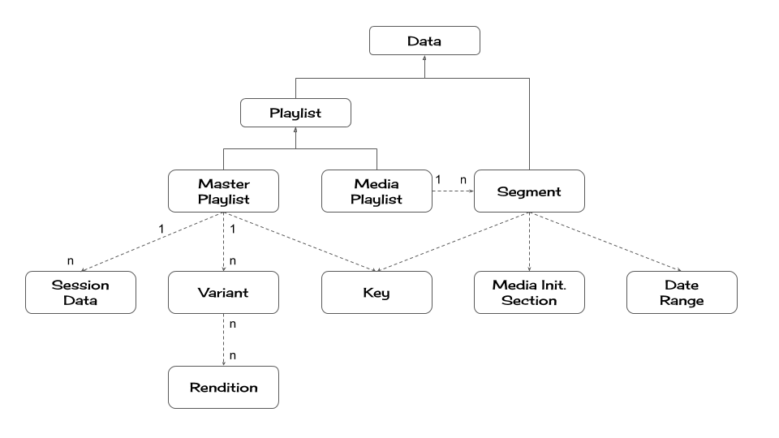

[](https://travis-ci.org/kuu/hls-parser)
[](https://coveralls.io/github/kuu/hls-parser?branch=master)
[](https://gemnasium.com/github.com/kuu/hls-parser)
[](https://github.com/sindresorhus/xo)

# hls-parser

Provides synchronous functions to read/write HLS playlists

## Features
* Read playlist and segment files based on [the spec](https://tools.ietf.org/html/draft-pantos-http-live-streaming-21).
* Converts them files into standard JS objects (See **Data format**.)
* Converts the JS objects back into HLS playlist and segment files that conform to [the spec](https://tools.ietf.org/html/draft-pantos-http-live-streaming-21).

## Usage
```js
const {Parser} = require('hls-parser');
const parser = new Parser();

fetch('https://foo.com/bar.m3u8')
.then(result => {
  return result.text();
})
.then(data => {
  return parser.parse(data, url);
}).then(playlist=> {
  if (playlist.isMasterPlaylist) {
    console.log(`Master playlist: ${playlist.uri}`);
  } else {
    console.log(`Media playlist: ${playlist.uri}`);
  }
  playlist.uri = new URL('http://my.site.com/bar.m3u8');
  console.log(`Modified playlist: ${parser.serialize(playlist)}`);
});

```

## API
### `constructor([options])`
Creates a new `Parser` object.
#### params
| Name    | Type   | Required | Default | Description   |
| ------- | ------ | -------- | ------- | ------------- |
| options | object | No       | {}      | See below     |
#### options
Currently no params are supported.
| Name        | Type   | Default | Description                       |
| ----------- | ------ | ------- | --------------------------------- |

### `Parser`
#### methods
##### `parse(data, url)`
Converts a text playlist into a structured JS object
###### params
| Name    | Type   | Required | Default | Description   |
| ------- | ------ | -------- | ------- | ------------- |
| data    | string | Yes      | N/A     | Text data of [an HLS playlist](https://tools.ietf.org/html/draft-pantos-http-live-streaming-21#section-4.1) |
| url     | string | Yes      | N/A     | URL of the playlist, which will be used as a base URL of the playlists/segments encountered within the playlist |
###### return value
An instance of either `MasterPlaylist` or `MediaPlaylist` (See below.)

##### `serialize()`
Converts a JS object into a plain text playlist
###### params
No params
###### return value
Text data of [an HLS playlist](https://tools.ietf.org/html/draft-pantos-http-live-streaming-21#section-4.1) |

## Data format
As the readable stream returned by `createReadStream` operates in object mode, the data emitted by the stream is always a JS object. This section describes the structure of the object.



### `Data`
| Property         | Type          | Required | Default | Description   |
| ---------------- | ------------- | -------- | ------- | ------------- |
| `type` | string     | Yes      | N/A     | Either `playlist` or `segment`}  |

### `Playlist` (extends `Data`)
| Property         | Type          | Required | Default | Description   |
| ---------------- | ------------- | -------- | ------- | ------------- |
| `isMasterPlaylist` | boolean     | Yes      | N/A     | `true` if this playlist is a master playlist  |
| `uri`              | `URL` (WHATWG) | Yes      | N/A     | Playlist URL  |
| `version`          | object | No       | undefined      | See [EXT-X-VERSION](https://tools.ietf.org/html/draft-pantos-http-live-streaming-21#section-4.3.1.2) |
| `independentSegments` | boolean | No       | false      | See [EXT-X-INDEPENDENT-SEGMENTS](https://tools.ietf.org/html/draft-pantos-http-live-streaming-21#section-4.3.5.1) |
| `offset` | object | No       | 0.0      | See [EXT-X-START](https://tools.ietf.org/html/draft-pantos-http-live-streaming-21#section-4.3.5.2) |
| `source` | string     | No      | undefined     | The unprocessed text of the playlist  |

### `MasterPlaylist` (extends `Playlist`)
| Property          | Type     | Required | Default   | Description   |
| ----------------- | -------- | -------- | --------- | ------------- |
| `variants`        | [`Variant`]  | No       | []        | See [ EXT-X-STREAM-INF](https://tools.ietf.org/html/draft-pantos-http-live-streaming-21#section-4.3.4.2) and [EXT-X-I-FRAME-STREAM-INF](https://tools.ietf.org/html/draft-pantos-http-live-streaming-21#section-4.3.4.3)  |
| `currentVariant`  | number   | No       | undefined | Array index that points to the chosen item in `variants` |
| `sessionDataList` | [`SessionData`]  | No       | []        | See [EXT-X-SESSION-DATA](https://tools.ietf.org/html/draft-pantos-http-live-streaming-21#section-4.3.4.4) |
| `sessionKey`      | `Key`    | No       | undefined | See [EXT-X-SESSION-KEY](https://tools.ietf.org/html/draft-pantos-http-live-streaming-21#section-4.3.4.5) |

### `Variant`
| Property          | Type     | Required | Default   | Description   |
| ----------------- | -------- | -------- | --------- | ------------- |
| `uri`        | `URL` (WHATWG)  | Yes       | N/A        | URI of the variant playlist  |
| `isIFrameOnly`  | boolean   | No       | undefined | `true` if the variant is an I-frame media playlist. See [EXT-X-I-FRAME-STREAM-INF](https://tools.ietf.org/html/draft-pantos-http-live-streaming-21#section-4.3.4.3) |
| `bandwidth` | number  | Yes       | N/A        | See BANDWIDTH attribute in [EXT-X-STREAM-INF](https://tools.ietf.org/html/draft-pantos-http-live-streaming-21#section-4.3.4.2) |
| `averageBandwidth`      | number    | No       | undefined | See AVERAGE-BANDWIDTH attribute in [EXT-X-STREAM-INF](https://tools.ietf.org/html/draft-pantos-http-live-streaming-21#section-4.3.4.2) |
| `codecs`      | string    | No       | undefined | See CODECS attribute in [EXT-X-STREAM-INF](https://tools.ietf.org/html/draft-pantos-http-live-streaming-21#section-4.3.4.2) |
| `resolution`      | object ({width: number, height: number})   | No       | undefined | See RESOLUTION attribute in [EXT-X-STREAM-INF](https://tools.ietf.org/html/draft-pantos-http-live-streaming-21#section-4.3.4.2) |
| `frameRate`      | number    | No       | undefined | See FRAME-RATE attribute in [EXT-X-STREAM-INF](https://tools.ietf.org/html/draft-pantos-http-live-streaming-21#section-4.3.4.2) |
| `hdcpLevel`      | string    | No       | undefined | See HDCP-LEVEL attribute in [EXT-X-STREAM-INF](https://tools.ietf.org/html/draft-pantos-http-live-streaming-21#section-4.3.4.2) |
| `audio`      | [`Rendition`(type='AUDIO')]    | No       | [] | See AUDIO attribute in [EXT-X-STREAM-INF](https://tools.ietf.org/html/draft-pantos-http-live-streaming-21#section-4.3.4.2) |
| `video`      | [`Rendition`(type='VIDEO')]    | No       | [] | See VIDEO attribute in [EXT-X-STREAM-INF](https://tools.ietf.org/html/draft-pantos-http-live-streaming-21#section-4.3.4.2)  |
| `subtitles`      | [`Rendition`(type='SUBTITLES')]    | No       | [] | See SUBTITLES attribute in [EXT-X-STREAM-INF](https://tools.ietf.org/html/draft-pantos-http-live-streaming-21#section-4.3.4.2)  |
| `closedCaptions`      | [`Rendition`(type='CLOSED-CAPTIONS')]    | No       | [] | See CLOSED-CAPTIONS attribute in [EXT-X-STREAM-INF](https://tools.ietf.org/html/draft-pantos-http-live-streaming-21#section-4.3.4.2) |
| `currentRenditions`      | object ({AUDIO: number, VIDEO: number, SUBTITLES: number, CLOSED-CAPTIONS: number})   | No       | {} | A hash object that contains array indices that points to the chosen `Rendition` for each type |

### `Rendition`
| Property          | Type     | Required | Default   | Description   |
| ----------------- | -------- | -------- | --------- | ------------- |
| `type`  | string   | Yes       | N/A | See TYPE attribute in [EXT-X-MEDIA](https://tools.ietf.org/html/draft-pantos-http-live-streaming-21#section-4.3.4.1) |
| `uri`        | `URL` (WHATWG)  | No       | undefined        | See URI attribute in [EXT-X-MEDIA](https://tools.ietf.org/html/draft-pantos-http-live-streaming-21#section-4.3.4.1)  |
| `groupId`  | string   | Yes       | N/A | See GROUP-ID attribute in [EXT-X-MEDIA](https://tools.ietf.org/html/draft-pantos-http-live-streaming-21#section-4.3.4.1) |
| `language` | string  | No       | undefined       | See LANGUAGE attribute in [EXT-X-MEDIA](https://tools.ietf.org/html/draft-pantos-http-live-streaming-21#section-4.3.4.1) |
| `assocLanguage` | string  | No       | undefined       | See ASSOC-LANGUAGE attribute in [EXT-X-MEDIA](https://tools.ietf.org/html/draft-pantos-http-live-streaming-21#section-4.3.4.1) |
| `name`  | string   | Yes       | N/A | See NAME attribute in [EXT-X-MEDIA](https://tools.ietf.org/html/draft-pantos-http-live-streaming-21#section-4.3.4.1) |
| `isDefault`  | boolean   | No       | false | See DEFAULT attribute in [EXT-X-MEDIA](https://tools.ietf.org/html/draft-pantos-http-live-streaming-21#section-4.3.4.1) |
| `autoselect`  | boolean   | No       | false | See AUTOSELECT attribute in [EXT-X-MEDIA](https://tools.ietf.org/html/draft-pantos-http-live-streaming-21#section-4.3.4.1) |
| `forced`  | boolean   | No       | false | See FORCED attribute in [EXT-X-MEDIA](https://tools.ietf.org/html/draft-pantos-http-live-streaming-21#section-4.3.4.1) |
| `instreamId`  | string   | No       | undefined | See INSTREAM-ID attribute in [EXT-X-MEDIA](https://tools.ietf.org/html/draft-pantos-http-live-streaming-21#section-4.3.4.1) |
| `characteristics`  | string   | No       | undefined | See CHARACTERISTICS attribute in [EXT-X-MEDIA](https://tools.ietf.org/html/draft-pantos-http-live-streaming-21#section-4.3.4.1) |
| `channels`  | string   | No       | undefined | See CHANNELS attribute in [EXT-X-MEDIA](https://tools.ietf.org/html/draft-pantos-http-live-streaming-21#section-4.3.4.1) |

### `SessionData`
| Property          | Type     | Required | Default   | Description   |
| ----------------- | -------- | -------- | --------- | ------------- |
| `id`  | string   | Yes       | N/A | See DATA-ID attribute in [EXT-X-SESSION-DATA](https://tools.ietf.org/html/draft-pantos-http-live-streaming-21#section-4.3.4.4) |
| `value`  | string   | No       | undefined | See VALUE attribute in [EXT-X-SESSION-DATA](https://tools.ietf.org/html/draft-pantos-http-live-streaming-21#section-4.3.4.4) |
| `uri`        | `URL` (WHATWG)  | No       | undefined        | See URI attribute in [EXT-X-SESSION-DATA](https://tools.ietf.org/html/draft-pantos-http-live-streaming-21#section-4.3.4.4)  |
| `data`        | object | No       | undefined        | If `uri` is specified, the downloaded JSON data  |
| `language`  | string   | No       | undefined | See LANGUAGE attribute in [EXT-X-SESSION-DATA](https://tools.ietf.org/html/draft-pantos-http-live-streaming-21#section-4.3.4.4) |

### `MediaPlaylist` (extends `Playlist`)
| Property                    | Type     | Required | Default   | Description   |
| --------------------------- | -------- | -------- | --------- | ------------- |
| `targetDuration`            | number | Yes       | N/A        | See [EXT-X-TARGETDURATION](https://tools.ietf.org/html/draft-pantos-http-live-streaming-21#section-4.3.3.1) |
| `mediaSequenceBase`         | number | No       | 0        | See [EXT-X-MEDIA-SEQUENCE](https://tools.ietf.org/html/draft-pantos-http-live-streaming-21#section-4.3.3.2) |
| `discontinuitySequenceBase` | number | No       | 0        | See [EXT-X-DISCONTINUITY-SEQUENCE](https://tools.ietf.org/html/draft-pantos-http-live-streaming-21#section-4.3.3.3) |
| `endlist`                   | boolean | No       | false        | See [EXT-X-ENDLIST](https://tools.ietf.org/html/draft-pantos-http-live-streaming-21#section-4.3.3.4) |
| `playlistType`              | string | No       | undefined        | See [EXT-X-PLAYLIST-TYPE](https://tools.ietf.org/html/draft-pantos-http-live-streaming-21#section-4.3.3.5) |
| `isIFrame`                  | boolean | No       | undefined        | See [EXT-X-I-FRAMES-ONLY](https://tools.ietf.org/html/draft-pantos-http-live-streaming-21#section-4.3.3.6) |
| `segments`                  | [`Segment`] | No       | []        | A list of available segments |

### `Segment` (extends `Data`)
| Property          | Type     | Required | Default   | Description   |
| ----------------- | -------- | -------- | --------- | ------------- |
| `uri`        | `URL` (WHATWG)  | Yes       | N/A        | URI of the media segment |
| `mimeType`        | string  | No       | undefined        | MIME type of the media segment |
| `data`        | `Buffer`   | No       | undefined        | downloaded data for the `uri` (the data is trimmed based on the `byterange`) |
| `duration`  | number   | Yes       | N/A | See [EXTINF](https://tools.ietf.org/html/draft-pantos-http-live-streaming-21#section-4.3.2.1) |
| `title`  | string   | No       | undefined | See [EXTINF](https://tools.ietf.org/html/draft-pantos-http-live-streaming-21#section-4.3.2.1) |
| `byterange`  | object ({length: number, offset: number})   | No       | undefined | See [EXT-X-BYTERANGE](https://tools.ietf.org/html/draft-pantos-http-live-streaming-21#section-4.3.2.2) |
| `discontinuity`  | boolean   | No       | undefined | See [EXT-X-DISCONTINUITY](https://tools.ietf.org/html/draft-pantos-http-live-streaming-21#section-4.3.2.3) |
| `mediaSequenceNumber`  | number   | Yes       | N/A | See the description about 'Media Sequence Number' in [3. Media Segments](https://tools.ietf.org/html/draft-pantos-http-live-streaming-21#page-5) |
| `discontinuitySequence`  | number   | Yes       | N/A | See the description about 'Discontinuity Sequence Number' in [6.2.1. General Server Responsibilities](https://tools.ietf.org/html/draft-pantos-http-live-streaming-21#section-6.2.1) |
| `key`  | `Key`   | No       | undefined | See [EXT-X-KEY](https://tools.ietf.org/html/draft-pantos-http-live-streaming-21#section-4.3.2.4) |
| `map`  | `MediaInitializationSection`   | No       | undefined | See [EXT-X-MAP](https://tools.ietf.org/html/draft-pantos-http-live-streaming-21#section-4.3.2.5) |
| `programDateTime`  | `Date`   | No       | undefined | See [EXT-X-PROGRAM-DATE-TIME](https://tools.ietf.org/html/draft-pantos-http-live-streaming-21#section-4.3.2.6) |
| `dateRange`  | `DateRange`   | No       | undefined | See [EXT-X-DATERANGE](https://tools.ietf.org/html/draft-pantos-http-live-streaming-21#section-4.3.2.7) |

### `Key`
| Property          | Type     | Required | Default   | Description   |
| ----------------- | -------- | -------- | --------- | ------------- |
| `method`  | string   | Yes       | N/A | See METHOD attribute in [EXT-X-KEY](https://tools.ietf.org/html/draft-pantos-http-live-streaming-21#section-4.3.2.4) |
| `uri`        | `URL` (WHATWG)  | No       | undefined        | See URI attribute in [EXT-X-KEY](https://tools.ietf.org/html/draft-pantos-http-live-streaming-21#section-4.3.2.4) |
| `data`        | `Buffer`(length=16) | No       | undefined        | If `uri` is specified, the downloaded key  |
| `iv`        | `Buffer`(length=16)   | No       | undefined        | See IV attribute in [EXT-X-KEY](https://tools.ietf.org/html/draft-pantos-http-live-streaming-21#section-4.3.2.4) |
| `format`  | string   | No       | undefined | See KEYFORMAT attribute in [EXT-X-KEY](https://tools.ietf.org/html/draft-pantos-http-live-streaming-21#section-4.3.2.4) |
| `formatVersion`  | string   | No       | undefined | See KEYFORMATVERSIONS attribute in [EXT-X-KEY](https://tools.ietf.org/html/draft-pantos-http-live-streaming-21#section-4.3.2.4) |

### `MediaInitializationSection`
| Property          | Type     | Required | Default   | Description   |
| ----------------- | -------- | -------- | --------- | ------------- |
| `uri`        | `URL` (WHATWG)  | Yes       | N/A        | See URI attribute in [EXT-X-MAP](https://tools.ietf.org/html/draft-pantos-http-live-streaming-21#section-4.3.2.5) |
| `mimeType`        | string  | No       | undefined        | MIME type of the media initialization section |
| `byterange`        | object ({length: number, offset: number})   | No       | undefined        | See BYTERANGE attribute in [EXT-X-MAP](https://tools.ietf.org/html/draft-pantos-http-live-streaming-21#section-4.3.2.5) |
| `data`        | `Buffer` | No       | undefined        | The downloaded media initialization section (the data is trimmed based on the `byterange`)  |

### `DateRange`
| Property          | Type     | Required | Default   | Description   |
| ----------------- | -------- | -------- | --------- | ------------- |
| `id`        | string  | Yes       | N/A        | See ID attribute in [EXT-X-DATERANGE](https://tools.ietf.org/html/draft-pantos-http-live-streaming-21#section-4.3.2.7) |
| `classId`        | string   | No       | undefined        | See CLASS attribute in [EXT-X-DATERANGE](https://tools.ietf.org/html/draft-pantos-http-live-streaming-21#section-4.3.2.7) |
| `start`        | `Date`  | Yes       | N/A        | See START-DATE attribute in [EXT-X-DATERANGE](https://tools.ietf.org/html/draft-pantos-http-live-streaming-21#section-4.3.2.7) |
| `end`        | `Date`  | No       | undefined        | See END-DATE attribute in [EXT-X-DATERANGE](https://tools.ietf.org/html/draft-pantos-http-live-streaming-21#section-4.3.2.7) |
| `duration`        | number  | No       | undefined        | See DURATION attribute in [EXT-X-DATERANGE](https://tools.ietf.org/html/draft-pantos-http-live-streaming-21#section-4.3.2.7) |
| `plannedDuration`        | number  | No       | undefined        | See PLANNED-DURATION attribute in [EXT-X-DATERANGE](https://tools.ietf.org/html/draft-pantos-http-live-streaming-21#section-4.3.2.7) |
| `endOnNext`        | boolean  | No       | undefined        | See END-ON-NEXT attribute in [EXT-X-DATERANGE](https://tools.ietf.org/html/draft-pantos-http-live-streaming-21#section-4.3.2.7) |
| `attributes`        | object  | No       | {}        | A hash object that holds SCTE35 attributes and user defined attributes. See SCTE35-* and X-<client-attribute> attributes in [EXT-X-DATERANGE](https://tools.ietf.org/html/draft-pantos-http-live-streaming-21#section-4.3.2.7) |
